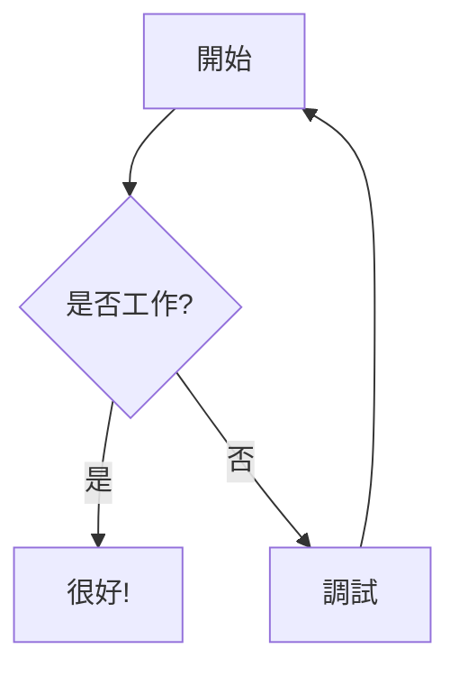

# ASIC 微架構安全攻擊與防禦深度技術指南

這是一個測試文件，包含中文字符。

## 功能特性

- 🚀 快速渲染
- 📝 支持中文編輯
- 🎨 語法高亮
- 📊 Mermaid 圖表支持

## 代碼示例

```dart
void main() {
  print('你好，世界！');
}
```

## Mermaid 圖表


```mermaid
graph TD
    A[開始] --> B{是否工作?}
    B -->|是| C[很好!]
    B -->|否| D[調試]
    D --> A
```

## 結論

這個文件測試了中文字符的處理能力。